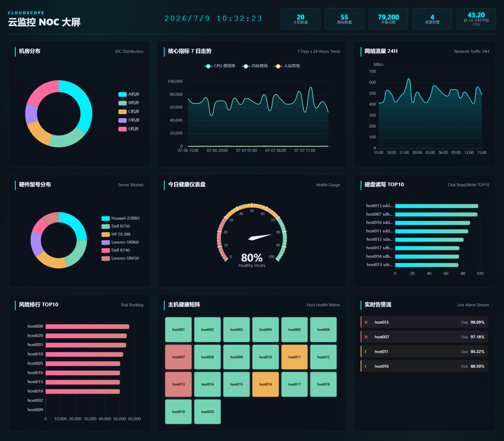

# CloudScope

CloudScope 是一个基于监控采集数据的可视化大屏项目，用于实时展示云主机的健康状态、性能指标和告警信息。



**技术栈：**

```text
前端：Vue 3 + TypeScript + Vite + ECharts
后端：FastAPI + SQLAlchemy + Python ETL
数据库：MySQL 8
测试：pytest + Vitest
代码质量：ruff + ESLint + Prettier
```

## 快速启动

### 方式一：Docker 一键部署（推荐）

```bash
# 1. 克隆项目
git clone git@github.com:UserLiTanYu/CloudScope.git
cd CloudScope

# 2. 一键启动所有服务
docker compose up -d

# 3. 访问前端大屏
# 浏览器打开 http://localhost
```

**服务说明：**
- MySQL：端口 3307，数据自动导入
- 后端 API：端口 8000，自动连接数据库
- 前端：端口 80，自动代理 API 请求

### 方式二：本地开发模式

```bash
# 1. 启动 MySQL
docker compose up -d mysql

# 2. 启动后端
cd backend
python -m venv .venv
.venv\Scripts\activate  # Windows
# source .venv/bin/activate  # Linux/Mac
pip install -r requirements.txt
cp .env.example .env  # 配置数据库连接
uvicorn app.main:app --reload

# 3. 启动前端
cd ../frontend
npm install
npm run dev
```

### 访问地址

- **前端大屏**：http://localhost（Docker）或 http://127.0.0.1:5173（开发模式）
- **后端 API**：http://127.0.0.1:8000
- **API 文档**：http://127.0.0.1:8000/docs
- **健康检查**：http://127.0.0.1:8000/api/health

## 大屏接口说明

### API 基础信息

- **Base URL**：`http://127.0.0.1:8000/api`
- **认证**：无（开发环境）
- **数据格式**：JSON

### 接口列表

#### 1. 健康检查

```http
GET /api/health
```

**响应示例：**

```json
{
  "status": "healthy",
  "database": "connected"
}
```

#### 2. 概览数据

```http
GET /api/metrics/overview
```

**响应示例：**

```json
{
  "host_count": 150,
  "metric_count": 25,
  "point_count": 1250000
}
```

**字段说明：**

| 字段 | 类型 | 说明 |
|------|------|------|
| host_count | int | 主机总数 |
| metric_count | int | 指标种类数 |
| point_count | int | 数据点总数 |

#### 3. 大屏数据（核心接口）

```http
GET /api/metrics/dashboard
```

**响应结构：**

```json
{
  "summary": [...],
  "trends": [...],
  "disk_top": [...],
  "cpu_top": [...],
  "memory_top": [...],
  "network_top": [...],
  "location_distribution": [...],
  "host_health": [...]
}
```

**字段详情：**

| 字段 | 类型 | 说明 |
|------|------|------|
| summary | SummaryMetric[] | 概览指标卡片 |
| trends | TrendSeries[] | 7日趋势数据 |
| disk_top | TopMetricItem[] | 磁盘使用 TOP10 |
| cpu_top | TopMetricItem[] | CPU 使用 TOP10 |
| memory_top | TopMetricItem[] | 内存使用 TOP10 |
| network_top | TopMetricItem[] | 网络流量 TOP10 |
| location_distribution | DistributionItem[] | 机房分布 |
| host_health | HostHealthRow[] | 主机健康状态 |

**数据模型：**

```typescript
// 概览指标
interface SummaryMetric {
  key: string        // 指标键
  label: string      // 显示标签
  value: number | string  // 指标值
  unit: string       // 单位
}

// 趋势系列
interface TrendSeries {
  name: string       // 系列名称（如 "CPU均值", "内存均值"）
  unit: string       // 单位
  points: MetricPoint[]  // 数据点
}

// 数据点
interface MetricPoint {
  collect_time: string  // ISO 时间戳
  value: number        // 指标值
}

// TOP 指标项
interface TopMetricItem {
  hostid: string     // 主机 ID
  hostname: string   // 主机名
  mod: string        // 指标模块
  value: number      // 指标值
  unit: string       // 单位
}

// 机房分布
interface DistributionItem {
  name: string       // 机房名称
  value: number      // 主机数量
}

// 主机健康状态
interface HostHealthRow {
  hostid: string     // 主机 ID
  hostname: string   // 主机名
  owner: string      // 负责人
  model: string      // 硬件型号
  location: string   // 位置
  cpu_usage: number | null   // CPU 使用率 (%)
  mem_used: number | null    // 内存使用 (MB)
  disk_util: number | null   // 磁盘使用率 (%)
}
```

#### 4. 指标时序数据

```http
GET /api/metrics/series?hostid={hostid}&mod={mod}&limit={limit}
```

**参数：**

| 参数 | 类型 | 必填 | 说明 |
|------|------|------|------|
| hostid | string | 是 | 主机 ID |
| mod | string | 是 | 指标模块名 |
| limit | int | 否 | 返回数据点数量（默认 200，最大 2000） |

**响应示例：**

```json
{
  "hostid": "H001",
  "mod": "cpu_usage",
  "points": [
    {
      "collect_time": "2024-01-15T10:00:00",
      "value": 45.2
    },
    ...
  ]
}
```

### 错误响应

```json
{
  "detail": "Not Found"
}
```

常见状态码：

| 状态码 | 说明 |
|--------|------|
| 200 | 成功 |
| 404 | 资源不存在 |
| 422 | 参数验证失败 |
| 500 | 服务器内部错误 |

## 页面功能说明

### 整体布局

大屏采用三栏布局，深色主题，适合大屏幕展示：

```text
┌────────────────────────────────────────────────────────────┐
│  CLOUDSCOPE 云监控 NOC 大屏                    2024-01-15 │
│  ┌──────┐ ┌──────┐ ┌──────┐ ┌──────┐ ┌──────┐           │
│  │ 主机 │ │ 指标 │ │ 数据 │ │ 健康 │ │ 告警 │           │
│  │ 数量 │ │ 种类 │ │ 总量 │ │ 评分 │ │ 数量 │           │
│  └──────┘ └──────┘ └──────┘ └──────┘ └──────┘           │
├──────────────┬───────────────────┬────────────────────────┤
│              │                   │                        │
│   机房分布    │   核心指标 7 日走势 │    网络流量 24H        │
│   (饼图)     │      (折线图)      │       (面积图)         │
│              │                   │                        │
├──────────────┤                   ├────────────────────────┤
│              │                   │                        │
│  硬件型号分布 │                   │    磁盘读写 TOP10      │
│   (饼图)     │   今日健康仪表盘   │       (柱状图)         │
│              │     (仪表盘)      │                        │
├──────────────┤                   ├────────────────────────┤
│              │                   │                        │
│  风险排行     │   主机健康矩阵    │    实时告警流           │
│  TOP10       │     (热力图)      │       (列表)           │
│  (柱状图)     │                   │                        │
│              │                   │                        │
└──────────────┴───────────────────┴────────────────────────┘
```

### 功能模块详情

#### 1. 顶部信息栏

**位置**：页面最顶部

**内容**：
- 左侧：项目标识 "CLOUDSCOPE" 和标题 "云监控 NOC 大屏"
- 中间：实时时钟（每秒更新）
- 右侧：5 个概览指标卡片
  - 主机总数
  - 指标种类
  - 数据点总量
  - 健康主机数
  - 活跃告警数

**交互**：
- 时钟自动更新
- 指标卡片实时刷新

#### 2. 左侧面板

**2.1 机房分布（IDC Distribution）**

- **图表类型**：环形饼图
- **数据来源**：`location_distribution`
- **展示内容**：各机房主机数量占比
- **交互**：
  - 鼠标悬停显示详细数值和百分比
  - 点击图例可隐藏/显示对应机房
- **颜色**：霓虹色系（#00f0ff, #74d4b3, #f0b35a 等）

**2.2 硬件型号分布（Server Models）**

- **图表类型**：环形饼图
- **数据来源**：`host_health` 中的 `model` 字段聚合
- **展示内容**：各硬件型号的服务器数量分布
- **交互**：同机房分布

**2.3 风险排行 TOP10（Risk Ranking）**

- **图表类型**：水平柱状图
- **数据来源**：`cpu_top`, `memory_top`, `network_top` 综合计算
- **风险评分公式**：
  ```javascript
  riskScore = cpu_usage + memory_used / 1280 + network_traffic * 2
  ```
- **展示内容**：风险评分最高的 10 台主机
- **交互**：
  - 鼠标悬停显示具体风险分值
  - 按风险值降序排列

#### 3. 中间面板

**3.1 核心指标 7 日走势（7 Days x 24 Hours Trend）**

- **图表类型**：多系列平滑折线图（带面积填充）
- **数据来源**：`trends`
- **展示内容**：
  - CPU 平均使用率趋势
  - 内存平均使用趋势
  - 网络流量趋势
- **时间范围**：最近 7 天，每小时一个数据点
- **交互**：
  - 鼠标悬停显示具体时间和数值
  - 点击图例可隐藏/显示系列
  - 支持缩放和平移

**3.2 今日健康仪表盘（Health Gauge）**

- **图表类型**：仪表盘（Gauge）
- **数据来源**：`host_health` 实时计算
- **健康评分算法**：
  ```javascript
  healthyCount = 主机总数中满足以下条件的数量：
    - CPU ≤ 80%
    - 磁盘 ≤ 85%
    - 内存 ≤ 90000 MB
  
  healthScore = (healthyCount / totalHosts) * 100
  ```
- **颜色区间**：
  - 0-30%：红色（危险）
  - 30-70%：黄色（警告）
  - 70-100%：绿色（健康）
- **展示内容**：健康主机百分比

**3.3 主机健康矩阵（Host Health Matrix）**

- **图表类型**：热力图矩阵
- **数据来源**：`host_health`
- **状态分类**：
  - 🟢 **健康（healthy）**：CPU ≤ 80%，磁盘 ≤ 85%，内存 ≤ 90000 MB
  - 🟡 **警告（warning）**：CPU 80-95%，磁盘 85-95%，内存 90000-110000 MB
  - 🔴 **危险（critical）**：CPU > 95%，磁盘 > 95%，内存 > 110000 MB
- **交互**：
  - 鼠标悬停显示主机详情（主机名、CPU、磁盘使用率）
  - 颜色直观反映健康状态

#### 4. 右侧面板

**4.1 网络流量 24H（Network Traffic 24H）**

- **图表类型**：面积图
- **数据来源**：`trends` 中的 "入站带宽" 系列
- **展示内容**：过去 24 小时的网络入站流量
- **单位**：MB/s
- **交互**：
  - 鼠标悬停显示时间和流量值
  - 平滑曲线，便于观察趋势

**4.2 磁盘读写 TOP10（Disk Read/Write TOP10）**

- **图表类型**：水平柱状图
- **数据来源**：`disk_top`
- **展示内容**：磁盘使用率最高的 10 个主机/分区
- **排序**：按磁盘使用率降序
- **交互**：
  - 鼠标悬停显示具体数值
  - 标签显示主机 ID 和分区名

**4.3 实时告警流（Live Alarm Stream）**

- **组件类型**：滚动列表
- **数据来源**：`host_health` 实时计算
- **告警规则**：
  - 🔴 **Critical**：
    - CPU > 95%
    - 磁盘 > 95%
    - 内存 > 110000 MB
  - 🟡 **Warning**：
    - CPU 80-95%
    - 磁盘 85-95%
    - 内存 90000-110000 MB
- **展示内容**：
  - 告警级别标识（!! 或 !）
  - 主机 ID
  - 告警类型（CPU/Disk/Memory）
  - 当前值
- **排序**：Critical 告警优先显示
- **交互**：
  - 自动滚动
  - 无告警时显示 "暂无活跃告警"

### 实时更新机制

- **数据刷新**：页面加载时获取一次数据
- **时钟更新**：每秒刷新
- **响应式设计**：窗口大小变化时自动调整图表尺寸
- **性能优化**：
  - 使用 `nextTick` 确保 DOM 更新后再渲染图表
  - 防抖处理窗口 resize 事件
  - 组件销毁时释放图表实例

### 浏览器兼容性

- Chrome 90+
- Firefox 88+
- Safari 14+
- Edge 90+

## 项目结构

```text
CloudScope/
├─ backend/
│  ├─ app/                  # FastAPI 应用
│  │  ├─ api/               # HTTP 接口
│  │  │  ├─ health.py       # 健康检查接口
│  │  │  └─ metrics.py      # 指标数据接口
│  │  ├─ core/              # 配置、数据库、日志
│  │  │  ├─ config.py       # 应用配置
│  │  │  ├─ database.py     # 数据库连接
│  │  │  └─ logging.py      # 日志配置
│  │  ├─ models/            # SQLAlchemy 模型
│  │  │  ├─ host.py         # 主机模型
│  │  │  ├─ metric.py       # 指标模型
│  │  │  └─ tsar.py         # 采集数据模型
│  │  ├─ repositories/      # 数据访问层
│  │  │  └─ metrics.py      # 指标数据查询
│  │  ├─ schemas/           # Pydantic 响应模型
│  │  │  └─ metrics.py      # 响应数据结构
│  │  └─ services/          # 业务服务层
│  │     └─ metrics.py      # 指标业务逻辑
│  ├─ etl/                  # 数据加工入库
│  │  ├─ readers/           # 文件读取
│  │  │  └─ tabular.py      # TSV 文件读取器
│  │  ├─ transformers/      # 数据清洗转换
│  │  │  └─ records.py      # 数据转换器
│  │  ├─ loaders/           # MySQL 写入
│  │  │  └─ mysql.py        # MySQL Loader
│  │  └─ jobs/              # 导入任务入口
│  │     └─ import_data.py  # 数据导入任务
│  └─ tests/                # 后端测试
├─ frontend/
│  ├─ src/
│  │  ├─ api/               # API 调用
│  │  │  ├─ client.ts       # HTTP 客户端
│  │  │  └─ metrics.ts      # 指标 API
│  │  ├─ charts/            # 图表组件
│  │  ├─ components/        # 通用组件
│  │  ├─ stores/            # 状态管理
│  │  ├─ styles/            # 样式文件
│  │  └─ views/             # 页面视图
│  │     └─ Dashboard.vue   # 大屏主页面
│  └─ tests/                # 前端测试
├─ database/
│  ├─ schema.sql            # 数据库初始化脚本
│  └─ migrations/           # 数据库迁移
│     └─ 001_init.sql       # 初始化迁移
├─ scripts/                 # 工具脚本
├─ logs/                    # 日志目录
├─ docker-compose.yml       # Docker 配置
├─ .gitignore               # Git 忽略规则
├─ .pre-commit-config.yaml  # 代码质量钩子
├─ LICENSE                  # MIT 许可证
└─ README.md                # 项目文档
```

## 后端开发

```bash
cd backend
python -m venv .venv
.venv\Scripts\activate
pip install -r requirements.txt
copy .env.example .env
uvicorn app.main:app --reload
```

健康检查：

```text
http://127.0.0.1:8000/api/health
```

## 导入数据

```bash
cd backend
python -m etl.jobs.import_data
```

也可以指定数据目录：

```bash
python -m etl.jobs.import_data --data-dir "C:\Users\litan\Desktop\code\可视化大屏\数据"
```

## 前端开发

```bash
cd frontend
npm install
npm run dev
```

默认访问：

```text
http://127.0.0.1:5173
```

## 测试与代码质量

后端：

```bash
cd backend
pytest
pytest --cov=app --cov=etl --cov-report=term-missing
ruff check .
mypy .
```

前端：

```bash
cd frontend
npm run test
npm run lint
npm run build
```

日志默认写入：

```text
logs/cloudscope.log
```

本项目 Docker MySQL 默认发布到宿主机：

```text
127.0.0.1:3307
```
